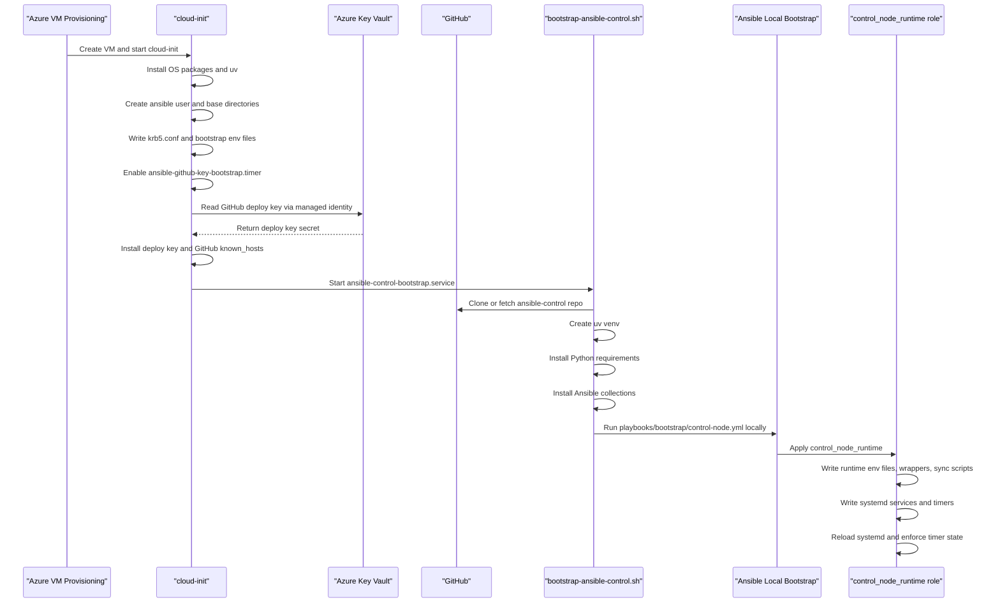
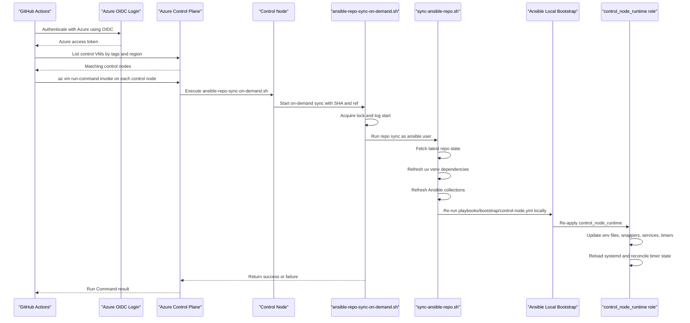

# Control Node Bootstrap

## Purpose

This document describes the bootstrap model for an Ubuntu 24.04 Azure-hosted Ansible control node.

The companion cloud-init template is:

- `/Users/ekene/Documents/projects/dg/ansible-control/cloud-init/control-node-ubuntu-2404.yaml`

## Two-Phase Model

The control node is built in two phases:

1. `cloud-init` performs first-boot bootstrap.
2. Ansible manages the steady state of the controller.

This keeps `cloud-init` small and avoids turning first-boot scripts into the long-term configuration system.

## What Cloud-Init Owns

`cloud-init` is responsible for only the minimum bootstrap needed to make the node manageable:

- create the `ansible` user
- install base OS packages
- install `uv`
- write `/etc/krb5.conf`
- fetch the GitHub deploy key from Azure Key Vault using managed identity
- clone the repo
- create the runtime venv
- install Python dependencies and collections
- run the local control-node bootstrap playbook once

It also writes a small controller-local vars file:

- `/etc/ansible-control-node.yml`

That file carries the node-specific identity needed by the shared role defaults:

- `control_node_runtime_environment`
- `control_node_runtime_subscription_alias`
- `control_node_runtime_region`

The bootstrap entrypoint is:

- `/usr/local/bin/bootstrap-ansible-control.sh`

That script exists only to get the controller from "new VM" to "Ansible can now manage itself".

## What Ansible Owns

The steady-state controller configuration is managed by the `control_node_runtime` role.

That role owns:

- `/etc/default/ansible-control-runtime`
- wrapper scripts for playbook and inventory execution
- repo sync scripts
- systemd units and timers for scheduled controller jobs
- future drift-check and reconcile jobs

By default, `cloud-init` remains the owner of `/etc/default/ansible-repo-sync` and `/etc/ansible-control-node.yml`.
The role consumes those files and manages the steady-state runtime around them.

This means persistent operational behavior is defined in the repo instead of being embedded in `cloud-init`, while node identity stays local to the controller.

## Runtime Model

The control node uses a dedicated repository runtime instead of globally installed Ansible packages.

Key paths:

- repository: `/home/ansible/src/ansible-control`
- virtual environment: `/home/ansible/.venvs/ansible-control`

The virtual environment is created with `uv` and populated from:

- `/Users/ekene/Documents/projects/dg/ansible-control/requirements.txt`
- `/Users/ekene/Documents/projects/dg/ansible-control/collections/requirements.yml`

The control node bootstrap then passes `/etc/ansible-control-node.yml` into the local bootstrap playbook so each controller can compute its own default inventory path from:

- environment
- subscription alias
- region

The local bootstrap playbook also loads `/etc/ansible-control-node.yml` directly, so later reconcile runs keep using the controller's own environment, subscription alias, and region instead of falling back to role defaults.

## Why a Fixed Venv Path

A fixed venv path makes execution predictable for:

- interactive playbook runs
- event-driven repo sync
- systemd services
- future drift-check and scheduled reconciliation jobs

All persistent automation on the controller should use the role-managed wrapper scripts so every execution uses the same repo and Python environment.

## Event-Driven Sync

The GitHub OIDC workflow triggers on-demand repo sync by calling `az vm run-command invoke` against the control node.

That event-driven path should target the role-managed on-demand sync script after the initial bootstrap is complete.

The intended ownership split is:

- `cloud-init`: initial bootstrap only
- Ansible: ongoing repo-sync behavior and systemd-managed jobs

## Sequence Diagrams

### First Boot

### Merged PR Sync

## Kerberos Requirements

Windows `psrp` over `https` with Kerberos requires the control node to have:

- a valid `/etc/krb5.conf`
- correct DNS resolution for the AD domain and Windows host FQDNs
- network access to domain controllers and target Windows hosts
- accurate time synchronization

The cloud-init template writes a placeholder `/etc/krb5.conf` and expects these placeholders to be replaced:

- `__KERBEROS_REALM__`
- `__KERBEROS_DOMAIN__`

## Design Outcome

The result is:

- a smaller and more focused cloud-init
- one source of truth for steady-state controller config
- predictable execution through a fixed `uv` venv
- better separation between bootstrap concerns and long-term automation
- controller-local identity without hardcoding every node to the same inventory file
